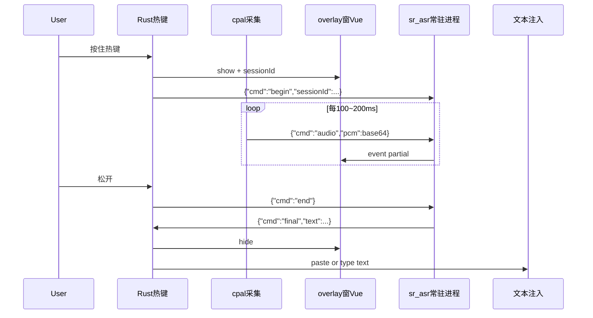

# 语音输入（SR）— 开发方案（本地流式 · Tauri 2 + Vue 3）

> **目标**：Windows 轻量级「按住说话、边说边出字」——全局快捷键触发悬浮录音条，**本地流式 ASR**，松手后将文本注入当前焦点输入框。  
> **约束**：v1 仅 Windows；**不上云**；热键路径避免每次识别冷启动子进程。  
> **工程目录**：`SR/`（独立 Tauri 子工程，P0）；`workspaces/sr_asr/`（可选 Python 识别常驻进程与模型脚本）。  
> **演进**：P0 独立验证 → P1 并入果粒橙工具箱（`app/`），与 `next` 中「语音输入」对齐。  
> 文档版本：v1.0 | 更新日期：2026-05-23

---

## 1. 背景与定位

### 1.1 用户场景

| 场景 | 行为 |
|------|------|
| 任意应用输入 | 在 Word / 浏览器 / 聊天框中需要打字 |
| 按住热键 | 屏幕边缘或鼠标附近出现**录音悬浮条**（动画 + 实时字幕） |
| 边说边显 | 本地模型**流式**返回 partial 文本，悬浮条滚动更新 |
| 松开热键 | 输出 final 文本 → **模拟键盘输入**或**剪贴板粘贴**到原焦点 |
| 后台常驻 | 托盘图标；主设置窗可关闭；识别引擎进程常驻（模型已加载） |

### 1.2 与工具箱 / 快捷翻译的关系

| 阶段 | 形态 | 说明 |
|------|------|------|
| **P0** | `SR/` 独立 `tauri dev` | 验证：热键 + 麦克风 + 流式 partial + 注入 |
| **P1** | 并入 `app/` | `app/src-tauri/src/speech/` + `SpeechInputView.vue` + 设置项 |
| **参考** | `快捷翻译-开发方案.md` | 同样「先子工程、后合并」；**不走** `plugins/manifest` 子进程冷启动 |

### 1.3 产品边界（v1）

**包含**

- 全局快捷键（**按住说话 / Push-to-Talk**）
- 麦克风采集（默认输入设备）
- 本地**流式**识别（partial + final）
- 悬浮 overlay（波形/电平动画 + 实时文字）
- 松手后文本注入焦点控件
- 托盘、基础设置（热键、模型路径、输出模式）
- 模型首次下载指引（不随安装包内置大模型，或提供「精简包 + 可选下载」）

**不包含（后续）**

- 系统内录（WASAPI loopback / 虚拟声卡）
- 离线标点/语气词智能润色（可接本地 LLM，另立项）
- macOS / Linux（结构预留，v1 仅 Windows）
- 与「文本比对」联动（见 `next`，P2+）
- 云端 ASR 备用通道（P2 可选开关）

---

## 2. 方案结论

### 2.1 为何选「流式」以及用什么引擎

| 引擎 | 流式能力 | 中文质量 | 与 Tauri 集成 | 结论 |
|------|----------|----------|---------------|------|
| **Sherpa-ONNX** | ✅ 原生流式 partial | 好（Paraformer / Zipformer 流式模型） | Python 常驻 或 `sherpa-rs` | **v1 推荐** |
| Vosk | ✅ partial | 中等 | Python / 官方 API | 备选（更轻、略逊） |
| Whisper 系 | ⚠️ 需分块+VAD，非真流式 | 很好 | `whisper.cpp` / faster-whisper | **不适合**「边说边出字」主线 |
| Windows SAPI | 部分 | 一般 | WinRT | 仅作无模型降级 |

**结论**：主线采用 **Sherpa-ONNX 流式模型**（ONNX + CPU int8 量化），中英混合场景优先 **streaming zipformer bilingual** 或 **streaming paraformer 中文**。

### 2.2 技术栈

| 层级 | 选型 | 说明 |
|------|------|------|
| 桌面壳 | **Tauri 2** | 与工具箱一致 |
| 热键 / 托盘 | **Rust** + `tauri-plugin-global-shortcut` | 与快捷翻译一致 |
| 音频采集 | **Rust `cpal`** | 16 kHz mono PCM，环形缓冲推送给 ASR |
| 流式 ASR | **P0：`workspaces/sr_asr` Python 常驻进程** | `sherpa-onnx` 官方示例改 daemon；模型启动时加载一次 |
| 流式 ASR | **P1+：Rust `sherpa-rs` 或同进程 ONNX** | 去掉 Python 依赖，降低内存与部署复杂度 |
| 悬浮 UI | **Vue 3** 独立小窗 `overlay` | 透明、置顶、无边框、跳过任务栏 |
| 文本注入 | **Rust `enigo` 或 `SendInput`** | 优先「粘贴模式」减少中文输入法冲突；可选逐字打字 |
| 配置 | `%APPDATA%/果粒橙工具箱/sr.json` 或独立 `sr-settings.json` | P0 可独立文件名 |

### 2.3 为何 P0 用 Python 常驻、而不是每次 subprocess

| 方案 | 问题 |
|------|------|
| 每次按住热键 `python recognize.py` | 模型加载 1～5s，无法满足流式体验 |
| **应用启动时拉起 `streaming_asr.py --daemon`** | 模型常驻内存；按住热键仅发 `begin`/`audio`/`end` | ✅ |
| 纯 Rust 一步到位 | 开发周期长；P1 再迁移 |

与 `workspaces/quick_translate/capture_clipboard.py` 不同：取词脚本轻、可单次调用；**ASR 必须常驻**。

### 2.4 音频与识别参数（默认值）

| 项 | 值 |
|----|-----|
| 采样率 | 16000 Hz |
| 声道 | mono |
| 样本格式 | float32 或 int16（与 Sherpa 示例一致） |
| 推流块大小 | 约 100～200 ms（1600～3200 samples @ 16k） |
| partial 节流 | 前端/UI 最多 10 次/秒刷新，避免闪烁 |
| 热键模式 | **按住录音，松开结束**（Push-to-Talk） |
| 默认热键 | `Alt+Shift+V`（可在设置中录制覆盖） |

---

## 3. 需求说明

### 3.1 功能需求

| ID | 需求 | 优先级 |
|----|------|--------|
| F1 | 应用启动时加载/拉起 ASR 常驻进程，报告 `ready` / `error` | P0 |
| F2 | 注册全局热键：按下 → 开始采集 + 显示 overlay | P0 |
| F3 | 松开热键 → 结束采集 → final 文本 → 注入焦点 | P0 |
| F4 | 流式 partial 文本推到 overlay 实时显示 | P0 |
| F5 | overlay：电平/波形动画 + 提示文案（「正在听…」） | P0 |
| F6 | 设置：热键、麦克风设备、模型目录、输出模式（粘贴/打字） | P0 |
| F7 | 托盘：启用热键、打开设置、重启引擎、退出 | P0 |
| F8 | 无语音/过短松开：提示「未检测到语音」 | P1 |
| F9 | 识别中按 Esc 取消，不注入 | P1 |
| F10 | 多屏：overlay 跟随光标所在显示器 | P1 |
| F11 | 并入工具箱设置页与首页卡片 | P1 |
| F12 | 可选：松手后保留 overlay 预览 1s 再注入 | P2 |

### 3.2 非功能需求

| ID | 需求 |
|----|------|
| NF1 | 环境：Windows 10/11 x64 |
| NF2 | 热键按下 → overlay 出现 &lt; 150ms（不含模型首次加载） |
| NF3 | 开始说话后 **首包 partial &lt; 500ms**（CPU + int8 小模型，实机调优） |
| NF4 | 空闲托盘 + 已加载小模型：内存目标 &lt; 400MB（Python 引擎）；P1 Rust 化后再压 |
| NF5 | 识别过程不写磁盘录音（隐私）；仅内存缓冲 |
| NF6 | 模型文件与程序分离，支持用户指定目录 |

### 3.3 输出模式

| 模式 | 行为 | 适用 |
|------|------|------|
| **粘贴（默认）** | final 写入剪贴板 → `Ctrl+V` → 可选恢复原剪贴板 | 中文、长句、各应用兼容好 |
| 打字 | `SendInput` 逐 Unicode 字符 | 短句、部分禁止粘贴的环境 |
| 仅复制 | 只写剪贴板，不模拟按键 | 用户手动粘贴 |

---

## 4. 架构

### 4.1 总体数据流



### 4.2 进程与线程（Rust 侧）

```text
Tauri 主进程
├── 全局热键监听（plugin-global-shortcut）
├── 音频线程：cpal stream → mpsc → 编码为 JSON 行发给 ASR stdin
├── ASR 守护：spawn 子进程、读 stdout 行、解析 partial/final
├── 会话状态机：Idle → Recording(sessionId) → Committing → Idle
└── overlay 窗口：emit Tauri events
```

### 4.3 会话状态机

```text
Idle
  │ hotkey pressed, engine ready
  ▼
Recording
  │ hotkey released
  ▼
Finalizing  ──timeout/error──► Idle (toast 错误)
  │ final received
  ▼
Injecting
  ▼
Idle
```

---

## 5. 目录结构（规划）

### 5.1 P0：独立子工程

```text
d:\VS\工具箱开发\
├── SR/                              # 本方案主工程（当前空目录 → 按此 scaffold）
│   ├── 开发方案.md                  # 本文档
│   ├── README.md
│   ├── package.json
│   ├── vite.config.ts
│   ├── src/
│   │   ├── main.ts
│   │   ├── App.vue
│   │   ├── views/
│   │   │   ├── SettingsView.vue
│   │   │   └── OverlayView.vue      # 录音悬浮条（独立 Tauri 窗）
│   │   ├── stores/
│   │   │   └── srSettings.ts
│   │   └── composables/
│   │       └── useOverlaySession.ts
│   └── src-tauri/
│       ├── Cargo.toml
│       ├── tauri.conf.json
│       ├── src/
│       │   ├── lib.rs
│       │   ├── hotkey.rs            # Push-to-Talk 按下/松开
│       │   ├── audio.rs             # cpal 设备枚举与采集
│       │   ├── asr_daemon.rs        # 管理 Python 子进程与 JSON 协议
│       │   ├── session.rs           # 状态机
│       │   ├── text_inject.rs       # 剪贴板 + Ctrl+V / enigo
│       │   └── settings.rs
│       └── resources/
│           └── models.manifest.json # 推荐模型列表与下载 URL（非模型本体）
├── workspaces/
│   └── sr_asr/                      # Python 流式引擎（新建）
│       ├── README.md
│       ├── requirements.txt
│       ├── streaming_asr.py         # --daemon 常驻入口
│       └── download_model.ps1       # 拉取 Sherpa 预训练包
└── app/                             # P1 合并目标
```

### 5.2 P1：合并入工具箱

| 内容 | 目标位置 |
|------|----------|
| Rust 模块 | `app/src-tauri/src/speech/` |
| overlay / 设置 UI | `app/src/views/SpeechOverlay.vue`、`SettingsView` 扩展 |
| 首页工具 | `stores/tools.ts` + `mockTools.ts` |
| 配置 | `get_settings` / `save_settings` 扩展或 `sr.json` |
| Python 工作区 | 仍用 `workspaces/sr_asr/`，由 Rust 解析 `toolbox_root()` |

**不创建** `plugins/sr/manifest.json`（无单次 CLI 工具需求）。

---

## 6. ASR 引擎（`workspaces/sr_asr`）

### 6.1 依赖（`requirements.txt` 草案）

```text
sherpa-onnx>=1.10.0
numpy>=1.24
```

> 使用官方 `pip install sherpa-onnx` 及预编译 wheel；无需本机编译 ONNX。

### 6.2 推荐模型（流式）

| 模型 | 体积量级 | 说明 |
|------|----------|------|
| `sherpa-onnx-streaming-zipformer-bilingual-zh-en-2023-02-20` | ~一两百 MB | 中英混合，**P0 默认** |
| `sherpa-onnx-streaming-paraformer-bilingual-zh-en` | 类似 | 备选 |
| 更小 int8 包 | 更小 | 弱机 / 低延迟优先时在 manifest 中标注 |

模型目录结构遵循 Sherpa 官方解压布局（`encoder.onnx`、`decoder.onnx`、`joiner.onnx`、`tokens.txt` 等），路径写入 `sr-settings.json` 的 `modelDir`。

### 6.3 Daemon 协议（stdin/stdout，**一行一条 JSON**）

**Host → ASR**

```json
{"cmd":"ping"}
{"cmd":"load","modelDir":"C:/Users/.../zipformer-bilingual"}
{"cmd":"begin","sessionId":"uuid","sampleRate":16000}
{"cmd":"audio","sessionId":"uuid","samples":"<base64 float32 mono>"}
{"cmd":"end","sessionId":"uuid"}
{"cmd":"shutdown"}
```

**ASR → Host**

```json
{"event":"ready","version":"..."}
{"event":"loaded","modelDir":"..."}
{"event":"partial","sessionId":"uuid","text":"你好","stable":false}
{"event":"final","sessionId":"uuid","text":"你好世界"}
{"event":"error","code":"NO_SPEECH","message":"..."}
```

约定：

- `partial.text` 为**当前整句假设**（非增量 delta），前端可做 diff 高亮或整句替换。
- 错误码统一枚举：`ENGINE_NOT_LOADED`、`MODEL_NOT_FOUND`、`AUDIO_DEVICE_ERROR`、`NO_SPEECH`。

### 6.4 本地开发命令

```powershell
cd "d:\VS\工具箱开发\workspaces\sr_asr"
python -m pip install -r requirements.txt
.\download_model.ps1
python streaming_asr.py --daemon
# 另开终端可用测试客户端往 stdin 喂 audio（后期可加 test_client.py）
```

---

## 7. UI 设计要点

### 7.1 录音悬浮条（`overlay`）

| 属性 | 值 |
|------|-----|
| 窗口 label | `sr-overlay` |
| 尺寸 | 宽约 360px，高 72～96px |
| 样式 | 圆角胶囊、半透明深色、细边框；与工具箱深色主题一致 |
| 行为 | 置顶、无边框、`skipTaskbar`、透明背景；**不抢焦点**（`focus: false`） |
| 位置 | 默认屏幕底部居中上方 80px；P1 可跟光标 |
| 内容 | 左侧电平条动画 + 右侧 partial 文本（超长省略头/尾） |
| 状态 | `listening` / `processing` / `error` |

### 7.2 设置页

| 配置项 | 控件 |
|--------|------|
| 启用语音输入 | 开关 |
| 按住说话快捷键 | 录制 |
| 麦克风设备 | 下拉（`cpal` 枚举） |
| 模型目录 | 文件夹选择 |
| 下载/校验模型 | 按钮 + 状态 |
| 输出模式 | 粘贴 / 打字 / 仅复制 |
| 松手后恢复剪贴板 | 开关（粘贴模式） |
| 引擎状态 | 绿/红 + 「重启引擎」 |

### 7.3 托盘菜单

```text
果粒橙 · 语音输入
├── 启用热键     [勾选]
├── 设置
├── 重启识别引擎
└── 退出
```

---

## 8. Tauri 接口设计（草案）

### 8.1 Commands

| 命令 | 参数 | 返回 | 说明 |
|------|------|------|------|
| `sr_get_settings` | — | `SrSettings` | 读配置 |
| `sr_save_settings` | `SrSettings` | — | 写配置 |
| `sr_engine_status` | — | `EngineStatus` | ready / loading / error |
| `sr_restart_engine` | — | — | 重启 Python daemon |
| `sr_list_audio_devices` | — | `AudioDevice[]` | 麦克风列表 |
| `sr_test_overlay` | — | — | 开发：手动显示 overlay |

### 8.2 Events（Rust → Vue）

| 事件名 | 载荷 |
|--------|------|
| `sr:engine` | `{ state, message? }` |
| `sr:session-start` | `{ sessionId }` |
| `sr:partial` | `{ sessionId, text }` |
| `sr:session-end` | `{ sessionId, text, ok, error? }` |
| `sr:level` | `{ rms: number }` 约 30fps，仅 overlay 用 |

### 8.3 TypeScript 类型草案

```typescript
interface SrSettings {
  enabled: boolean
  hotkey: string           // e.g. "Alt+Shift+V"
  modelDir: string
  audioDeviceId: string | null
  outputMode: 'paste' | 'type' | 'clipboard'
  restoreClipboard: boolean
}

interface EngineStatus {
  state: 'idle' | 'loading' | 'ready' | 'error'
  message?: string
}
```

### 8.4 `tauri.conf.json` 多窗口（草案）

```json
{
  "windows": [
    { "label": "main", "title": "语音输入设置", "width": 520, "height": 640 },
    {
      "label": "sr-overlay",
      "url": "/overlay",
      "width": 380,
      "height": 88,
      "decorations": false,
      "transparent": true,
      "alwaysOnTop": true,
      "skipTaskbar": true,
      "visible": false,
      "focus": false
    }
  ]
}
```

---

## 9. 里程碑与验收

| 阶段 | 交付 | 验收标准 |
|------|------|----------|
| **M0** | `SR/` Tauri 空壳 + overlay 窗 + 托盘 | `tauri dev` 可手动弹出 overlay |
| **M1** | `cpal` 采集 + 电平条 | 按住测试键能看到波形随麦克风变化 |
| **M2** | `sr_asr` daemon + load 模型 | `ping`/`load` 返回 `ready`；日志无报错 |
| **M3** | 按住热键 → partial 上屏 | 对麦克风说中文，overlay **1s 内**出现逐字更新 |
| **M4** | 松开 → 粘贴到记事本 | 记事本焦点下松手，final 文本出现在光标处 |
| **M5** | 设置持久化 + 设备选择 | 重启应用配置仍在 |
| **M6** | 合并工具箱 P1 | 从工具箱设置进入；与翻译模块共存无热键冲突 |

---

## 10. 风险与对策

| 风险 | 对策 |
|------|------|
| 模型体积大 | 安装包不内置；首次向导 + `download_model.ps1` |
| Python 部署复杂 | P0 接受；P1 迁移 `sherpa-rs`；或 PyInstaller 单文件引擎 |
| 中文输入法与模拟按键冲突 | 默认**粘贴模式**；打字模式作高级选项 |
| 焦点丢失导致注入错窗口 | 按下热键时缓存 `GetForegroundWindow`，注入前还原焦点 |
| partial 闪烁 | UI 节流；可选仅显示 final（设置开关） |
| 杀毒误报 | 代码签名、开源说明；避免钩子注入式键盘监控 |
| 与快捷翻译热键冲突 | 设置页检测重复；默认不同组合键 |

---

## 11. P1 以后：Rust 化 ASR（可选路线）

1. 引入 [`sherpa-rs`](https://github.com/thewh1teagle/sherpa-rs) 或自绑 `sherpa-onnx` C API。  
2. `audio.rs` 直接喂 `OnlineRecognizer`。  
3. 删除 Python 子进程，安装包只带 ONNX 模型目录。  
4. 目标：空闲内存 &lt; 250MB，首 partial &lt; 300ms（同档 CPU）。

---

## 12. 与仓库 `next` 的对应

```text
translate      → 已有 app 内翻译模块，SR 不重复
语音输入       → 本方案（SR）
文本比对       → 可在 SR final 后增加「编辑再注入」P2
```

---

## 13. 建议的下一步（实施顺序）

1. 在 `SR/` 执行 `npm create tauri-app`（Vue + TS），按 §5.1 建目录。  
2. 新建 `workspaces/sr_asr/`，从 Sherpa 官方 `python-api-examples/streaming_server.py` 精简为 `streaming_asr.py`。  
3. 实现 `asr_daemon.rs` 行协议与 `M2` 验收。  
4. 接 `hotkey.rs` Push-to-Talk + `OverlayView.vue`（`M3`）。  
5. 实现 `text_inject.rs` 粘贴链路（`M4`）。  

---

*文档维护：随实机模型与延迟测试结果，更新 §2.4、§6.2 默认值与 NF3 指标。*
