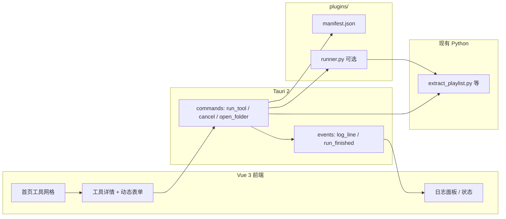

# Python 脚本工具箱 — 开发方案（Tauri 2 + Vue 3）

> 目标：在 Windows 上提供**统一、好看、动效丰富**的桌面工具箱，聚合多个已有 Python 脚本；用户通过图形界面选工具、填参数、看日志，无需记命令行。  
> 约束：**不破坏**现有脚本的 CLI 用法；脚本可独立运行，工具箱仅做「壳 + 调度」。  
> **应用名称**：果粒橙工具箱  
> **桌面工程根目录**：`d:\VS\工具箱开发\`（Cursor 当前项目，含 `app/`、`plugins/`）  
> **Python 工作区**：本仓库下 **`workspaces/music_crawl/`**（按程序分子目录，后续新程序放入 `workspaces/<名称>/`；`.venv` 在各自子目录创建，设置页可改路径）  
> 文档版本：v1.4 | 更新日期：2026-05-20

---

## 1. 背景与现状

### 1.1 现有资产（本仓库 `workspaces/music_crawl/`，自原 `爬取音乐/` 项目同步必需脚本）

| 类别 | 脚本/模块 | 说明 |
|------|-----------|------|
| 歌单 OCR | `playlist_ocr/extract_playlist.py` | 截图识歌单 → `songs.txt` |
| OCR 检测版 | `playlist_ocr/extract_playlist_detect.py` | 检测模型路线（可选） |
| 批量爬取 | `batch_crawl_2t58.py` | 批量搜索/爬取 |
| 全自动下载 | `full_auto_download_2t58.py` | 端到端下载流程 |
| Cookie | `export_2t58_cookies.py`、`cookie_loader.py` | 登录态导出/加载 |
| 待办更新 | `update_pending_songs.py` | 重试列表维护 |
| 评估 | `playlist_ocr/evaluate_accuracy.py` | OCR 准确率评估 |

当前使用方式：在终端手动 `python xxx.py --参数`，路径与 venv 需用户自行管理。

### 1.2 待解决问题

| 痛点 | 说明 |
|------|------|
| 入口分散 | 多个脚本、多个目录，新人难上手 |
| 无统一 UI | 参数靠记忆，日志刷屏难读 |
| 环境不直观 | `.venv`、`requirements-ocr.txt` 与主 `requirements.txt` 分离 |
| 体验不足 | 需要「炫」的选中、切换、进度反馈，命令行无法满足 |

### 1.3 方案结论

采用 **Tauri 2 + Vue 3 + TypeScript** 做桌面壳，**插件化**接入现有 Python 脚本：

- **前端**：Vue 负责界面与动效（Tailwind + Motion/GSAP）
- **桥接**：Tauri Command 启动子进程，实时回传 stdout/stderr
- **脚本**：保持原文件不动，每个工具增加薄封装 `runner.py` + `manifest.json`

打包安装包（`.msi` / `.exe`）放在**后期里程碑**，本阶段以 `tauri dev` 本机开发为主。

---

## 2. 需求说明

### 2.1 功能需求

| ID | 需求 | 优先级 |
|----|------|--------|
| F1 | 首页展示工具卡片网格，支持分类筛选 | P0 |
| F2 | 点击工具进入详情页，根据 manifest **动态生成表单** | P0 |
| F3 | 执行 Python 脚本，底部/侧边 **实时日志** | P0 |
| F4 | 运行中显示状态（排队/运行中/成功/失败），可取消 | P1 |
| F5 | 记住上次参数、工作目录（本地配置） | P1 |
| F6 | 打开工具相关文件夹（如 `images_in/`、`downloads/`） | P1 |
| F7 | 设置页：配置 Python 解释器路径、项目根目录 | P0 |
| F8 | 新增工具只需加插件目录，无需改核心壳代码 | P0 |

### 2.2 非功能需求

| ID | 需求 |
|----|------|
| NF1 | 主开发环境：Windows 10/11 |
| NF2 | 开发期允许依赖本机已安装的 Python + `.venv` |
| NF3 | 单工具执行互不阻塞 UI（异步 + 日志流） |
| NF4 | 启动到首页可交互 &lt; 3s（`tauri dev` 冷启动除外） |
| NF5 | 界面支持深色主题，动效流畅（60fps 为目标） |

### 2.3 不在第一阶段范围

- 内置 Python 运行时（安装包自带解释器）  
- 自动更新 / 应用商店分发  
- 脚本在线市场、远程下载插件  
- macOS / Linux 构建（可预留，不承诺 v1）

### 2.4 产品决策（2026-05-19 确认）

| 项 | 决策 | 说明 |
|----|------|------|
| 应用名 | **果粒橙工具箱** | 窗口标题、`tauri.conf.json`、关于页统一 |
| 主界面 | **先按本文 §5.3 卡片网格** | 不满意再换「左侧图标栏 + 右侧动态区」线框主壳 |
| 「一键爬取音乐」 | **工具内专用两阶段 UI** | 不走通用 manifest 表单；见 **§5.4** |
| 进入爬取阶段 | **按钮** | OCR 校对完成后点「确认歌单并开始爬取」进入阶段 B |
| OCR 框操作 | 拖移、拉角缩放、双击改字、删框、加框 | **每次改框后再次调用脚本**识别该框对应歌曲 |
| 爬取页歌曲列表 | **OCR 多图汇总** | 阶段 B 左侧列表 = 阶段 A 合并结果 |
| 爬取执行 | **一键爬取** | 对接 `full_auto_download_2t58.py`；启动前写入 `songs.txt` |
| 其它工具 | 仍用 manifest + 动态表单 | batch_crawl、export_cookies 等保持插件化 |

---

## 3. 技术选型

### 3.1 技术栈总览

| 层级 | 选型 | 版本建议 |
|------|------|----------|
| 桌面壳 | Tauri | 2.x |
| 前端框架 | Vue | 3.5+ |
| 语言 | TypeScript | 5.x |
| 构建 | Vite | 6.x |
| 样式 | Tailwind CSS | 4.x |
| 动效 | `@vueuse/motion` 或 `motion-v` | 最新 |
| 进阶动效 | GSAP（可选，复杂时间轴时用） | 3.x |
| 路由 | vue-router | 4.x |
| 状态 | pinia | 2.x |
| 图标 | `@iconify/vue` 或 `lucide-vue-next` | — |
| 桥接 | Tauri 2 Command + Event | — |
| 后端逻辑 | 现有 Python 脚本（subprocess） | 3.10+ |

### 3.2 为何不用「纯 Python UI」

动效与视觉上限需求已明确为「很炫」；Web 技术栈 + Tauri 在卡片动效、主题、布局上成本更低，且与 Python 脚本解耦，便于独立迭代 UI。

### 3.3 Python 调用策略

| 阶段 | 方式 | 说明 |
|------|------|------|
| M1～M3 | `subprocess` + 项目根下 `.venv\Scripts\python.exe` | 隔离性好，与原 CLI 一致 |
| M4+（打包） | 评估 PyInstaller 单文件 exe 或内置嵌入式 Python | 安装包阶段再定 |

**原则**：优先传 CLI 参数，不把业务逻辑搬进 Rust；Rust 只负责进程管理与 IO 转发。

---

## 4. 总体架构

### 4.1 逻辑架构



### 4.2 目录结构（规划）

```text
d:\VS\工具箱开发\                    # 桌面工具箱工程（本仓库）
├── 开发方案.md
├── app/                             # Tauri + Vue 工程
│   ├── src/
│   │   ├── views/
│   │   ├── components/
│   │   ├── stores/
│   │   └── assets/
│   ├── src-tauri/
│   │   ├── src/lib.rs
│   │   └── tauri.conf.json
│   └── package.json
├── plugins/                         # 工具插件（manifest + 桥接脚本，见 plugins/README.md）
│   ├── playlist_ocr/
│   │   ├── manifest.json
│   │   └── region_ocr.py
│   └── ...
├── workspaces/                      # 各接入程序的运行目录（脚本、数据相对此处分目录）
│   ├── README.md
│   └── music_crawl/                 # 音乐爬取：与插件 manifest 中的路径一致
│       ├── batch_crawl_2t58.py
│       ├── full_auto_download_2t58.py
│       ├── playlist_ocr/
│       └── .venv/                   # 本地创建，见 workspaces/music_crawl/README.md
├── scripts/                         # 开发辅助等（可选）
│   └── dev/
└── README.md                        # 仓库顶层索引
```

**说明**：`app/` 为 Tauri 前端与宿主根；`plugins/` 与 `workspaces/` 与 `app/` 同属 `工具箱开发/`。通过设置项 **`workspace_root`** 默认指向本仓库 **`workspaces/music_crawl/`**，音乐相关脚本路径均相对该根解析；接入其它程序时可指向 `workspaces/<另一目录>/`。

### 4.3 插件 manifest 规范（草案）

```json
{
  "id": "playlist_ocr",
  "name": "歌单截图识别",
  "description": "从 QQ 音乐歌单截图提取歌名-歌手，输出 songs.txt",
  "category": "音乐",
  "icon": "scan",
  "tags": ["ocr", "offline"],
  "script": {
    "entry": "playlist_ocr/extract_playlist.py",
    "interpreter": "venv",
    "cwd": "playlist_ocr"
  },
  "params": [
    {
      "name": "input_dir",
      "label": "截图目录",
      "type": "folder",
      "default": "playlist_ocr/images_in"
    },
    {
      "name": "debug",
      "label": "调试模式",
      "type": "boolean",
      "flag": "--debug"
    }
  ],
  "outputs": [
    { "label": "songs.txt", "path": "songs.txt", "action": "open_folder" }
  ]
}
```

| 字段 | 必填 | 说明 |
|------|------|------|
| `id` | 是 | 唯一标识 |
| `name` | 是 | 显示名称 |
| `script.entry` | 是 | 相对工作区根的脚本路径 |
| `script.interpreter` | 否 | `venv` \| `python` \| 绝对路径 |
| `params[].type` | 是 | `string` \| `number` \| `boolean` \| `file` \| `folder` \| `select` |
| `params[].flag` | 否 | 映射为 CLI，如 `--debug` |

---

## 5. UI / 动效设计要点

### 5.1 视觉方向

- **主题**：深色为主（背景 `#0f0f12`～`#1a1a22`），强调色 1 种（如青蓝 `#22d3ee` 或紫 `#a78bfa`）
- **卡片**：圆角 16px，玻璃态（`backdrop-blur` + 半透明边框）
- **字体**：系统 UI 栈 + 可选中文无衬线（思源黑体 / 鸿蒙等，本地有则用）

### 5.2 动效清单（P0 必做）

| 场景 | 效果 | 实现建议 |
|------|------|----------|
| 首页加载 | 卡片依次 `fade + slide up`（stagger） | `@vueuse/motion` stagger |
| 卡片 hover | 轻微上浮 + 阴影 + 边框高亮 | CSS `transform` + `transition` |
| 卡片选中 | 缩放 1.02 + 外发光 + 指示条滑入 | `motion` + `layoutId`（若用 motion-v） |
| 分类切换 | 列表交叉淡入淡出 | Vue `<TransitionGroup>` |
| 进入工具页 | 共享元素过渡（可选） | vue-router + motion |
| 运行按钮 | 点击涟漪 / 加载旋转 | CSS 或 GSAP |
| 日志追加 | 新行高亮渐隐 | 仅最后 N 行 accent 背景 |

### 5.3 页面结构（线框）

```text
┌─────────────────────────────────────────────────────────┐
│  [Logo]  果粒橙工具箱            [设置] [关于]            │
├──────────┬──────────────────────────────────────────────┤
│ 分类     │  ┌────┐ ┌────┐ ┌────┐ ┌────┐                 │
│ · 全部   │  │ OCR│ │爬取│ │下载│ │Cookie│  ← 卡片网格   │
│ · 音乐   │  └────┘ └────┘ └────┘ └────┘                 │
│ · 工具   │                                               │
├──────────┴──────────────────────────────────────────────┤
│  （通用工具详情：manifest 表单 + 日志；音乐工具见 §5.4）   │
└─────────────────────────────────────────────────────────┘
```

### 5.4 「一键爬取音乐」专用界面（线框）

> 从首页卡片进入该工具后，使用下列布局（**非**首页侧栏线框）。主壳若日后改为侧栏式，本工具内部两阶段不变。

**阶段 A — 识图 / 校对**

```text
┌──────────┬────────────┬─────────────────────────────┐
│ 截图     │  参数区    │  大图预览                    │
│ 缩略图   │  开始扫描  │  扫描后叠 OCR 框             │
│ 垂直列表 │  (单张/全部)│  用户可拖移/缩放/改字/删增框  │
└──────────┴────────────┴─────────────────────────────┘
         [ 确认歌单并开始爬取 ]  ← 按钮进入阶段 B
```

- 改框后：将框坐标回传 Python，**对该区域重新识别**并更新汇总条目（需在 `runner.py` 或 OCR 模块增加按框识别接口）。
- 扫描：调用 `playlist_ocr/extract_playlist.py`（或 detect 路线，manifest 可配置）。

**阶段 B — 一键爬取**

```text
┌──────────────┬────────────────────────────┐
│  歌曲列表    │  参数区（一键爬取相关 CLI）  │
│  (OCR 汇总)  ├────────────────────────────┤
│              │  终端 / 实时日志            │
└──────────────┴────────────────────────────┘
```

- 「一键爬取」：写 `songs.txt` 后执行 `full_auto_download_2t58.py`；日志走 `tool:log` 事件。
- 支持 `cancel_run` 中断长任务。

**备选主壳（未采用，可回退）**

```text
左侧圆形工具图标 │ 右侧随工具切换（首个 = 拖入截图入口）
```

---

## 6. Tauri 侧接口设计（草案）

### 6.1 Commands

| 命令 | 参数 | 返回 | 说明 |
|------|------|------|------|
| `list_plugins` | `workspace_root` | `PluginMeta[]` | 扫描 `plugins/**/manifest.json` |
| `run_tool` | `plugin_id`, `params` | `run_id` | 启动子进程 |
| `cancel_run` | `run_id` | `bool` | 终止进程树 |
| `get_settings` | — | `Settings` | 读本地 json |
| `save_settings` | `Settings` | — | 写本地 json |
| `open_path` | `path` | — | 用系统资源管理器打开 |
| `recognize_regions` | `image_path`, `boxes[]` | `SongLine[]` | （音乐工具）按框重识别，供阶段 A 改框后刷新 |

### 6.2 Events（推送到前端）

| 事件名 | 载荷 |
|--------|------|
| `tool:log` | `{ run_id, stream, line }` |
| `tool:exit` | `{ run_id, code }` |

### 6.3 安全与权限（`tauri.conf.json`）

开发期按需开启：

- `shell:allow-spawn`（执行 python）
- `dialog:allow-open`（选文件夹）
- `fs:allow-read` 限定在工作区根目录下

---

## 7. 环境与初始化（你当前阶段）

### 7.1 已安装自检

在 **PowerShell（新窗口）** 执行：

```powershell
node -v
npm -v
rustc -V
cargo -V
```

若均正常，进入 **7.2 创建项目**。

### 7.2 创建 Tauri + Vue 项目

在 **`d:\VS\工具箱开发\`** 下执行：

```powershell
cd "d:\VS\工具箱开发"
npm create tauri-app@latest
```

推荐选项：

| 步骤 | 选择 |
|------|------|
| Project name | `app` |
| Frontend language | TypeScript |
| Package manager | pnpm（或 npm） |
| UI template | Vue |
| UI flavor | TypeScript |

创建后：

```powershell
cd app
pnpm install
pnpm add vue-router pinia @vueuse/motion
pnpm add -D tailwindcss @tailwindcss/vite
pnpm tauri dev
```

首次 `tauri dev` 会编译 Rust 依赖，耗时较长，属正常现象。

### 7.3 前端依赖（动效向）

```powershell
pnpm add @iconify/vue
# 可选
pnpm add gsap
```

---

## 8. 里程碑与验收标准

### M0：环境就绪（当前）

| 任务 | 验收 |
|------|------|
| Node / Rust / MSVC / WebView2 安装完成 | 上述版本命令均有输出 |
| `pnpm tauri dev` 弹出空窗口 | 窗口可打开、可关闭 |

### M1：壳 + 首页（约 3～5 天）

| 任务 | 验收 |
|------|------|
| 创建 `app/`，`tauri.conf` 应用名 **果粒橙工具箱** | `npm run tauri dev` 可开窗口 |
| 配置 Tailwind、深色主题 | 全局样式生效 |
| 静态工具卡片 4～6 个（写死数据） | stagger 入场、hover、选中动效流畅 |
| vue-router：首页 ↔ 占位详情页 | 「一键爬取音乐」进专用占位路由 |

### M2：插件扫描 + 动态表单（约 5～7 天）

| 任务 | 验收 |
|------|------|
| `plugins/playlist_ocr/manifest.json` 落地 | `list_plugins` 能读到 |
| 详情页按 `params` 渲染输入控件 | 与 manifest 一致 |
| 设置页配置 `workspace_root`、`python_path` | 持久化到 `%APPDATA%/...`；默认本仓库 **`workspaces/music_crawl/`**（相对 `src-tauri` 解析） |

### M2.5：一键爬取音乐 · 专用 UI（约 7～10 天）

| 任务 | 验收 |
|------|------|
| 阶段 A 三栏 + 扫描（单张/全部） | 缩略图切换、大图显示 OCR 框 |
| 框编辑 + `recognize_regions` | 拖移/缩放/改字/删增框后列表更新 |
| 按钮进入阶段 B | 汇总列表正确 |
| 阶段 B + `full_auto_download` | 终端实时日志；可取消 |

### M3：执行与日志（约 5～7 天）

| 任务 | 验收 |
|------|------|
| `run_tool` 调用 `extract_playlist.py` | 日志实时滚动 |
| 成功/失败状态展示 | exit code 非 0 时 UI 标红 |
| `cancel_run` | 运行中可中断 |

### M4：接入更多工具（约 3～5 天）

| 任务 | 验收 |
|------|------|
| batch_crawl、full_auto_download、export_cookies 等 manifest | 首页分类筛选正确 |
| 「打开输出目录」 | 能打开 `songs.txt` 所在文件夹 |

### M5：打包与发布（后期）

| 任务 | 验收 |
|------|------|
| `pnpm tauri build` 产出 Windows 安装包 | 本机双击可安装运行 |
| 图标、应用名、版本号 | `tauri.conf.json` 配置完整 |
| （可选）内置 Python 或 PyInstaller sidecar | 无全局 Python 的机器可运行 |

---

## 9. 首批接入工具映射

| 插件 id | 入口脚本 | 默认 cwd | 备注 |
|---------|----------|----------|------|
| `music_crawl` | （专用 UI，见 §5.4） | `playlist_ocr` / 项目根 | 首页主推；含 OCR 阶段 + 一键爬取 |
| `playlist_ocr` | `playlist_ocr/extract_playlist.py` | `playlist_ocr` | 需 `requirements-ocr.txt` 环境 |
| `playlist_ocr_detect` | `playlist_ocr/extract_playlist_detect.py` | `playlist_ocr` | 可选 |
| `batch_crawl` | `batch_crawl_2t58.py` | 项目根 | 依赖 playwright 等 |
| `full_auto_download` | `full_auto_download_2t58.py` | 项目根 | 长任务，务必支持取消 |
| `export_cookies` | `export_2t58_cookies.py` | 项目根 | 可能需浏览器交互 |
| `update_pending` | `update_pending_songs.py` | 项目根 | 短任务 |

OCR 类工具建议在 manifest 中注明 `venv` 使用 `playlist_ocr` 独立依赖或统一 `.venv` 的策略（在设置页可切换）。

---

## 10. 风险与对策

| 风险 | 对策 |
|------|------|
| 首次 `tauri dev` / `build` 很慢 | 预留时间；确保 MSVC 已装「C++ 桌面开发」 |
| Python 环境不一致 | 设置页强制指定解释器；运行前检测 `--version` |
| 脚本阻塞无输出 | 子进程 `PYTHONUNBUFFERED=1`；必要时 `python -u` |
| Playwright 等需浏览器 | 工具描述中标注；运行前检查依赖 |
| 路径含中文 | 全程 UTF-8；Rust 侧用 wide 路径 API |
| MSI 构建失败 | 后期再处理；开发期用 `nsis` 或便携 exe |

---

## 11. 参考命令速查

```powershell
# 开发
cd "d:\VS\工具箱开发\app"
npm run tauri dev

# 仅前端（调 UI）
npm run dev

# 生产构建（M5）
npm run tauri build

# Rust 格式化/检查（可选）
cd src-tauri
cargo check
```

---

## 12. 文档维护

| 版本 | 日期 | 变更 |
|------|------|------|
| v1.0 | 2026-05-19 | 初稿：技术栈、架构、里程碑、manifest 草案 |
| v1.1 | 2026-05-19 | 产品决策 §2.4；果粒橙命名；音乐工具 §5.4 / M2.5 |
| v1.2 | 2026-05-19 | 桌面工程迁至 `d:\VS\工具箱开发\`；脚本曾放在外部 `爬取音乐/` |
| v1.3 | 2026-05-20 | 爬取音乐必需脚本纳入仓库 **`workspaces/music_crawl/`**；默认 `workspace_root` 指向该目录 |
| v1.4 | 2026-05-20 | 目录整理：`workspaces/` 按程序分文件夹；`scripts/dev/` 存放杂项脚本 |

后续实现中若 manifest 字段或目录有变更，请同步更新本文 **§4.2、§4.3、§9**。

---

## 附录 A：与 `playlist_ocr` 的关系

- `playlist_ocr/开发方案.md`：专注 OCR 算法与识别准确率。  
- **本文档**：专注桌面工具箱壳、UI、调度与发布。  
- 二者通过 `plugins/playlist_ocr/manifest.json` 衔接，**不合并仓库逻辑**，避免耦合。

---

## 附录 B：创建项目后的第一步（Checklist）

- [x] `npm run tauri dev` 成功（工程在 `app/`，包管理器 npm）
- [ ] 在 `plugins/` 新建 `playlist_ocr/manifest.json`
- [ ] 设置页默认 `workspace_root` 指向本仓库 **`workspaces/music_crawl/`**（已实现：`lib.rs` 默认 + 新建设置时生效）
- [ ] 实现 `list_plugins` Rust command
- [ ] 首页从接口读卡片数据，替换静态 mock
- [ ] 接一个工具跑通 `extract_playlist.py` 端到端

完成附录 B 即达到 **M2 + M3 最小闭环**，可在此基础上扩展动效与其它工具。
