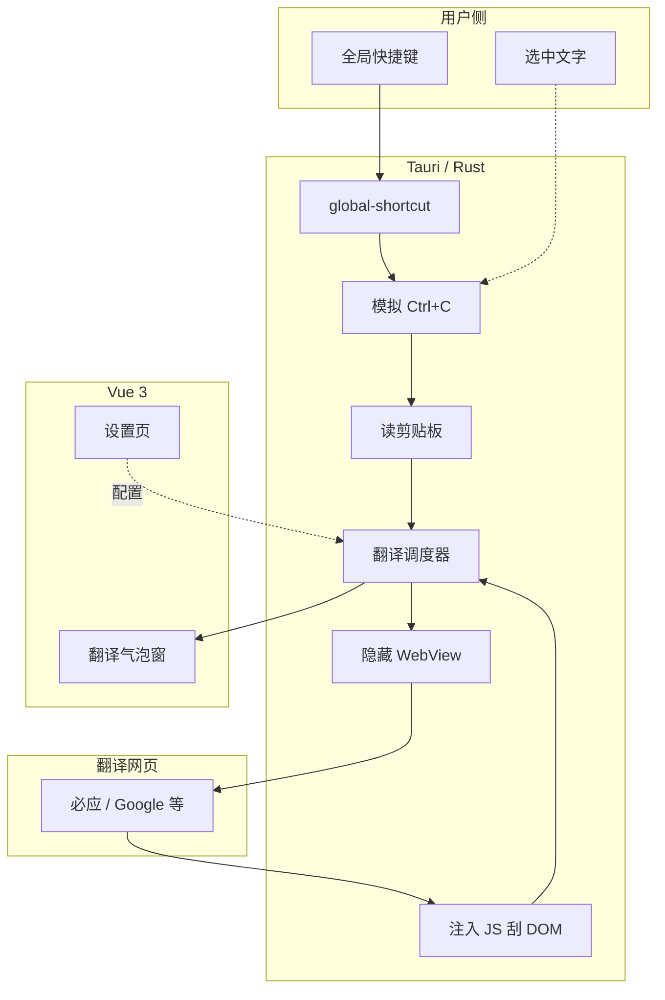

# 快捷翻译 — 开发方案（Tauri 2 + Vue 3）

> **目标**：在 Windows 上提供轻量级「选中即译」工具——按下全局快捷键后，抓取当前选中文字，通过**访问翻译网页**（非开放平台 API）获取译文，在鼠标附近弹出结果气泡。  
> **约束**：不申请翻译 API Key；翻译逻辑依赖 WebView 加载公开翻译页并从 DOM 提取结果。  
> **演进**：先可**独立运行**（托盘 + 热键 + 气泡）；稳定后并入**果粒橙工具箱**（`app/`），共享配置与品牌。  
> **关联文档**：`开发方案.md`（工具箱总方案）、`plugins/README.md`（本工具**不走** manifest 子进程模式）  
> 文档版本：v1.0 | 更新日期：2026-05-22

---

## 1. 背景与定位

### 1.1 用户场景

| 场景 | 行为 |
|------|------|
| 阅读外文 | 在浏览器 / PDF / 编辑器中选中一段文字 |
| 触发翻译 | 按预设快捷键（如 `Ctrl+Shift+T`） |
| 查看结果 | 鼠标附近出现小气泡，显示译文；数秒后自动消失或点击复制 |
| 后台常驻 | 应用在托盘，主窗口可关闭；开机可选自启（后期） |

### 1.2 与果粒橙工具箱的关系

| 阶段 | 形态 | 说明 |
|------|------|------|
| **P0** | 独立子工程或 `app` 内后台模块 | 单独 `tauri dev` 可验证热键与翻译链路 |
| **P1** | 并入工具箱 | 设置页配置快捷键、目标语言、翻译源；首页增加工具卡片（进入设置/说明） |
| **不采用** | `plugins/manifest.json` + Python `run_tool` | 热键路径需毫秒级响应，避免 subprocess 冷启动 |

### 1.3 产品边界（v1）

**包含**

- 全局快捷键
- 获取系统选中文字（模拟 `Ctrl+C` + 剪贴板）
- 隐藏 WebView 加载翻译网页并提取译文
- 多翻译源可配置、可切换默认源
- 目标语言预设（如「译为简体中文」）
- 托盘图标、基础设置页

**不包含（后续版本）**

- 语音输入翻译（见仓库 `next` 备忘）
- 文本比对 / 双语对照编辑器
- 离线翻译、本地模型
- 替换选中文字（写回焦点控件，实现复杂且易误操作）
- macOS / Linux（可预留结构，v1 仅 Windows）

---

## 2. 方案结论

### 2.1 技术栈

| 层级 | 选型 | 说明 |
|------|------|------|
| 桌面壳 | **Tauri 2** | 与工具箱一致；体积小、可托盘常驻 |
| 系统集成 | **Rust** | 全局热键、剪贴板、模拟按键、WebView 调度 |
| 界面 | **Vue 3 + TypeScript** | 翻译气泡窗、设置页；复用 Tailwind 习惯 |
| 翻译获取 | **隐藏 WebView + DOM 抓取** | 不调用开放平台 API；URL 与选择器外置配置 |
| 构建 | **Vite 6** | 与 `app/` 相同 |

### 2.2 依赖插件（Tauri 官方 / 社区）

| 插件 | 用途 |
|------|------|
| `tauri-plugin-global-shortcut` | 注册/注销全局快捷键 |
| `tauri-plugin-clipboard-manager` | 读剪贴板、可选写回 |
| 内置 `tray` | 托盘菜单：设置、暂停热键、退出 |
| 已有 `windows` crate | `SendInput` 模拟 `Ctrl+C`（与工具箱 `Cargo.toml` 一致） |

### 2.3 为何不用 Python / Electron

| 方案 | 结论 |
|------|------|
| Python + `keyboard` | 全局钩子权限与稳定性差，打包重，与工具箱主栈不一致 |
| Electron | 后台常驻内存占用高；项目已选 Tauri |
| 开放平台 API | 用户明确要求不用 API Key；本方案用网页源 |

### 2.4 合规与风险声明（开发须知）

- 自动访问翻译网站并提取内容，可能违反对应网站**服务条款**；仅限**个人自用**，不宜商用或高频批量请求。
- 选中文字会经 HTTPS 发送至第三方翻译站（与用户自行打开网页等价）。
- 网页 DOM 改版会导致抓取失败，需通过**多源备份 + 外置选择器配置** 降低维护成本。

---

## 3. 需求说明

### 3.1 功能需求

| ID | 需求 | 优先级 |
|----|------|--------|
| F1 | 注册全局快捷键，触发翻译流程 | P0 |
| F2 | 获取当前选中文字（无选中时提示） | P0 |
| F3 | 按配置的目标语言与翻译源，加载网页并解析译文 | P0 |
| F4 | 在光标附近显示翻译气泡（置顶、无边框、可拖动） | P0 |
| F5 | 气泡内支持复制译文、关闭 | P0 |
| F6 | 设置：快捷键、目标语言、默认翻译源、超时秒数 | P0 |
| F7 | 托盘图标：打开设置、启用/禁用热键、退出 | P0 |
| F8 | 多翻译源：主源失败自动尝试备用源 | P1 |
| F9 | 同一段原文短时缓存，避免重复开页 | P1 |
| F10 | 并入工具箱：设置页入口与配置共用 | P1 |
| F11 | 翻译中显示 loading 状态（气泡或托盘） | P1 |
| F12 | 长文本截断或提示「文本过长」 | P1 |

### 3.2 非功能需求

| ID | 需求 |
|----|------|
| NF1 | 主环境：Windows 10/11 |
| NF2 | 热键响应到出现 loading：&lt; 300ms（不含网页加载） |
| NF3 | 端到端（含网页）：目标 &lt; 5s，超时可配置默认 8s |
| NF4 | 空闲时仅托盘常驻，内存占用尽量低于完整工具箱主窗口 |
| NF5 | 配置持久化到 `%APPDATA%/果粒橙工具箱/` 或独立 `quick-translate.json` |
| NF6 | 翻译源选择器、URL 模板与主程序解耦（`translators.json`） |

### 3.3 默认产品参数（可改）

| 项 | 默认值 |
|----|--------|
| 快捷键 | `Ctrl+Shift+T` |
| 目标语言 | 简体中文（`zh-Hans`） |
| 默认翻译源 | `bing`（国内访问相对稳定；实现时以实机为准） |
| 备用源 | `google` |
| 气泡自动关闭 | 12 秒 |
| 请求超时 | 8 秒 |
| 缓存 TTL | 30 秒 |

---

## 4. 总体架构

### 4.1 逻辑架构



### 4.2 核心流程（时序）

```text
1. 用户按下 Ctrl+Shift+T
2. Rust：保存当前剪贴板（可选）→ SendInput Ctrl+C → 等待 80～150ms → 读取剪贴板文本
3. 若文本为空或与上次相同且缓存有效 → 直接显示缓存或提示
4. 显示气泡 loading；创建/复用隐藏 WebView
5. 按 translators.json 拼接 URL（urlEncode 原文）
6. WebView navigate → 监听加载完成 / 轮询 eval
7. eval 执行 resultSelector，取 innerText / textContent
8. 成功 → 推送事件到气泡窗显示；失败 → 尝试下一翻译源
9. 全部失败 → 气泡显示错误 + 「在浏览器中打开」链接
```

### 4.3 获取选中文字的说明

Windows **没有**统一 API 供第三方读取「他应用中的选区」。标准做法：

1. 模拟 `Ctrl+C`（`SendInput`）
2. 读取剪贴板 UTF-8 文本
3. （可选）恢复用户原剪贴板内容

**注意**：在未支持复制的控件（部分游戏、安全软件）会失败，需友好提示。

---

## 5. 目录结构（规划）

### 5.1 推荐：独立子工程（P0）

便于先独立运行，不干扰现有 `app` 构建：

```text
d:\VS\工具箱开发\
├── 快捷翻译-开发方案.md          # 本文档
├── quick-translate/              # 快捷翻译 Tauri 工程（新建）
│   ├── package.json
│   ├── src/
│   │   ├── main.ts
│   │   ├── views/
│   │   │   ├── SettingsView.vue
│   │   │   └── BubbleView.vue      # 翻译气泡（小窗）
│   │   ├── stores/
│   │   │   └── translateSettings.ts
│   │   └── composables/
│   │       └── useTranslateBubble.ts
│   ├── src-tauri/
│   │   ├── src/
│   │   │   ├── lib.rs
│   │   │   ├── hotkey.rs           # 热键注册
│   │   │   ├── clipboard.rs        # 剪贴板 + Ctrl+C
│   │   │   ├── web_translator.rs   # WebView 调度与刮取
│   │   │   └── providers.rs        # 加载 translators.json
│   │   ├── resources/
│   │   │   └── translators.json    # 翻译源定义（可热更新）
│   │   └── tauri.conf.json
│   └── README.md
└── app/                            # 果粒橙工具箱（P1 合并目标）
```

### 5.2 合并入工具箱后（P1）

| 内容 | 位置 |
|------|------|
| Rust 模块 | `app/src-tauri/src/translate/` |
| 气泡 / 设置 UI | `app/src/views/QuickTranslate*.vue` |
| 配置 | 合并进 `get_settings` / `save_settings` 或独立 `quick-translate.json` |
| 首页卡片 | `app/src/views/HomeView.vue` + `stores/tools.ts` 静态项 |

**仍不创建** `plugins/quick_translate/manifest.json`（除非日后增加「批量翻译文件」等 CLI 能力）。

---

## 6. 翻译源配置（`translators.json`）

### 6.1 设计原则

- 每个源一条记录：`id`、显示名、`urlTemplate`、`resultSelector`、`waitMs`、是否启用。
- `urlTemplate` 支持占位符：`{text}`、`{from}`、`{to}`（已 URL 编码）。
- 页面改版时**只改 JSON**，尽量不改 Rust 逻辑。
- MVP 实现 **必应**、**Google** 两个源；有道等 DOM 复杂，放 P2。

### 6.2 配置示例

```json
{
  "version": 1,
  "providers": [
    {
      "id": "bing",
      "name": "必应翻译",
      "enabled": true,
      "urlTemplate": "https://www.bing.com/translator?from={from}&to={to}&text={text}",
      "resultSelector": "[data-testid='translation-result'], .tta_output_src",
      "waitMs": 2500,
      "pollIntervalMs": 200,
      "maxPollAttempts": 30
    },
    {
      "id": "google",
      "name": "Google 翻译",
      "enabled": true,
      "urlTemplate": "https://translate.google.com/?sl={from}&tl={to}&op=translate&q={text}",
      "resultSelector": "[data-language-to-translate-target] span, .ryNqvb",
      "waitMs": 3000,
      "pollIntervalMs": 200,
      "maxPollAttempts": 35
    }
  ]
}
```

> **说明**：`resultSelector` 为草案，开发时必须在实机 WebView 中用 DevTools 校验；选择器失效是预期维护项。

### 6.3 语言代码映射

| 用户设置 | Bing `to` | Google `tl` |
|----------|-----------|-------------|
| 简体中文 | `zh-Hans` | `zh-CN` |
| 繁体中文 | `zh-Hant` | `zh-TW` |
| 英语 | `en` | `en` |
| 日语 | `ja` | `ja` |

在 `providers.rs` 或前端设置中维护一张 `targetLang → 各源参数` 映射表。

### 6.4 备用方案 B（非 v1，文档预留）

若 DOM 抓取稳定性不足，可增加「网页内部 XHR」适配层（仍无需 API Key），与 WebView 方案二选一或作降级。不在 M1 实现。

---

## 7. UI 设计要点

### 7.1 翻译气泡窗

| 属性 | 值 |
|------|-----|
| 窗口标签 | `translate-bubble` |
| 尺寸 | 宽约 320～420px，高度随内容，最大约 240px 滚动 |
| 样式 | 圆角 12px、深色半透明背景、细边框；与工具箱深色主题协调 |
| 行为 | 置顶、无边框、不在任务栏单独显示；失焦不立即关闭 |
| 位置 | 默认光标右下方偏移 16px；多屏时 clamp 到当前显示器工作区 |
| 内容 | 原文一行（省略）+ 分隔线 + 译文 + [复制] [关闭] |
| 状态 | loading 旋转 / 失败红色提示 |

### 7.2 设置页（独立或并入工具箱）

| 配置项 | 控件 |
|--------|------|
| 启用快捷翻译 | 开关 |
| 快捷键 | 录制按钮（监听下一组按键） |
| 目标语言 | 下拉 |
| 默认翻译源 | 下拉 |
| 失败时尝试备用源 | 开关 |
| 超时（秒） | 数字 3～15 |
| 翻译后恢复剪贴板 | 开关，默认开 |
| 打开翻译页调试 | 按钮（开发用，显示 WebView） |

### 7.3 托盘菜单

```text
果粒橙 · 快捷翻译
├── 启用热键     [勾选]
├── 设置
├── 在浏览器打开上次链接（失败时可用）
└── 退出
```

---

## 8. Tauri 接口设计（草案）

### 8.1 Commands

| 命令 | 参数 | 返回 | 说明 |
|------|------|------|------|
| `translate_selection` | — | `TranslateResult` | 手动触发一轮（与热键相同逻辑） |
| `get_translate_settings` | — | `TranslateSettings` | 读配置 |
| `save_translate_settings` | `TranslateSettings` | — | 写配置 |
| `list_translators` | — | `TranslatorProvider[]` | 读 `translators.json` |
| `reload_translators` | — | — | 重新加载翻译源配置 |
| `register_hotkey` | `accelerator` | — | 应用新快捷键 |
| `set_hotkey_enabled` | `enabled: bool` | — | 托盘切换用 |

### 8.2 Events（Rust → Vue）

| 事件名 | 载荷 |
|--------|------|
| `translate:started` | `{ requestId, sourceText }` |
| `translate:done` | `{ requestId, ok, text?, provider?, error? }` |
| `translate:open_browser` | `{ url }` 失败兜底 |

### 8.3 类型草案（TypeScript）

```typescript
interface TranslateSettings {
  enabled: boolean
  hotkey: string
  targetLang: string
  primaryProvider: string
  fallbackEnabled: boolean
  timeoutSec: number
  restoreClipboard: boolean
}

interface TranslateResult {
  ok: boolean
  translated?: string
  provider?: string
  error?: string
  durationMs: number
}
```

### 8.4 隐藏 WebView 窗口

| 属性 | 值 |
|------|-----|
| 标签 | `translate-scraper` |
| 可见性 | `visible: false` 或 1×1 像素（开发期可改为可见） |
| 生命周期 | 应用启动时创建一次，复用；`navigate` 前 `eval` 清空上一结果 |

---

## 9. 关键实现细节

### 9.1 模拟 Ctrl+C（Windows）

- 使用已有 `windows` crate：`SendInput` 发送 `VK_CONTROL` + `VK_C`。
- 延迟：发送后 `thread::sleep(100ms)` 再读剪贴板（可配置）。
- 若翻译前剪贴板已是目标文本，可跳过复制（优化）。

### 9.2 WebView 刮取脚本（伪代码）

```javascript
(function (selector) {
  const el = document.querySelector(selector)
  if (!el) return null
  const t = (el.innerText || el.textContent || '').trim()
  return t.length > 0 ? t : null
})(/* selector from config */)
```

- Rust 侧：`webview.eval(...)` 轮询直至非 null 或超时。
- 连续两次结果一致且非空可视为稳定，停止轮询。

### 9.3 长文本与 URL 长度

| 阈值 | 行为 |
|------|------|
| &gt; 1500 字符 | 截断并提示「已截断」 |
| URL &gt; 2000 字符 | 优先 POST 方案（P2）；MVP 仅截断 |

### 9.4 错误处理

| 错误 | 用户提示 |
|------|----------|
| 无选中 | 「请先选中文字」 |
| 剪贴板为空 | 「未能获取选中内容」 |
| 超时 | 「翻译超时，请换源或检查网络」 |
| 选择器未命中 | 自动下一源；全部失败则提供浏览器链接 |
| WebView 加载失败 | 同超时处理 |

---

## 10. 里程碑与验收标准

### M0：工程初始化（约 1 天）✅

| 任务 | 验收 |
|------|------|
| 创建 `quick-translate/` Tauri + Vue 工程 | `npm run tauri dev` 可开窗口 |
| 引入 `global-shortcut`、`clipboard-manager` | 编译通过 |
| 托盘图标显示 | 右键菜单可退出 |

> **2026-05-22 完成**：工程路径 `quick-translate/`，开发端口 `1422`，默认热键 `Ctrl+Shift+T`（触发占位事件，M1 接取词）。

### M1：热键 + 取词（约 2 天）✅

| 任务 | 验收 |
|------|------|
| 注册默认 `Ctrl+Shift+T` | 任意应用中按下可触发 |
| 模拟 Ctrl+C 读取剪贴板 | 记事本选中文字后可读到 |
| 可选恢复剪贴板 | 翻译后粘贴内容与翻译前一致 |
| 无选中时 toast / 气泡提示 | 不崩溃 |

> **2026-05-22 完成**：`selection.rs` 模拟复制；`capture.rs` 取词链路；配置 `%APPDATA%/果粒橙工具箱/quick-translate.json`；设置页可改热键与恢复剪贴板。

### M2：WebView 翻译链路（约 3～4 天）✅

| 任务 | 验收 |
|------|------|
| 落地 `translators.json`（必应 + Google） | 实机至少 1 源可稳定取到译文 |
| 隐藏 WebView + 轮询 eval | 日志可见耗时 |
| 超时与备用源切换 | 主源失败自动试次源 |
| 30 秒缓存 | 连续按热键同文本不重复开页 |

> **2026-05-22 完成**：`translate-scraper` 隐藏窗、`translator.rs` 刮取、`cache.rs` 缓存；热键链路取词→翻译；配置 `%APPDATA%/果粒橙工具箱/translators.json` 可覆盖。

### M3：气泡 UI + 设置（约 2～3 天）✅

| 任务 | 验收 |
|------|------|
| 光标旁气泡显示译文 | 位置合理、不挡全屏 |
| 复制 / 关闭 | 按钮可用 |
| 设置页改快捷键、语言、源 | 重启或热重载后生效 |
| loading / 错误态 | 用户可理解 |

> **2026-05-22 完成**：`translate-bubble` 透明置顶窗、`BubbleApp.vue`、`bubble.rs` 光标定位；热键成功不再弹主设置窗；`bubbleAutoCloseSec` 可配置。

### M4：独立发布就绪（约 1～2 天）

| 任务 | 验收 |
|------|------|
| `pnpm tauri build` 产出 exe | 无开发环境机器可运行 |
| README：用法、免责、翻译源维护说明 | 文档齐全 |
| 配置写入 `%APPDATA%` | 重装后保留（可选） |

### M5：并入果粒橙工具箱（约 2～3 天）

| 任务 | 验收 |
|------|------|
| Rust / Vue 模块迁入 `app/` | 工具箱启动后热键仍有效 |
| 工具箱设置页增加「快捷翻译」区 | 与独立版配置兼容 |
| 首页卡片进入说明或设置 | 与现有 UI 风格一致 |
| 工具箱未启动时可选独立 exe（后期） | 按产品决策 |

---

## 11. 测试计划

| 用例 | 步骤 | 预期 |
|------|------|------|
| T1 记事本 | 选中英文 → 热键 | 气泡显示中文 |
| T2 浏览器 | 网页选中段落 → 热键 | 译文正确 |
| T3 Word / PDF | 选中 → 热键 | 能取词或明确失败提示 |
| T4 无选中 | 直接热键 | 提示先选中 |
| T5 网络断开 | 热键 | 超时提示，不卡死 |
| T6 主源失效 | 关掉主源或改错选择器 | 备用源成功 |
| T7 长文本 | &gt;2000 字 | 截断提示 |
| T8 快捷键冲突 | 设为已被占用组合 | 设置页提示注册失败 |

---

## 12. 与工具箱配置的统一（P1）

建议最终统一路径：

```text
%APPDATA%/果粒橙工具箱/config.json
  └── quickTranslate: { ...TranslateSettings }
```

独立阶段可先用：

```text
%APPDATA%/果粒橙工具箱/quick-translate.json
```

合并时写迁移：读取旧文件 → 写入 `config.json` → 删除或保留备份。

---

## 13. 后续扩展（`next` 备忘）

| 功能 | 说明 |
|------|------|
| 语音输入 | 托盘或热键启动听写 → 再走同一翻译链路 |
| 文本比对 | 原文/译文对照窗，非热键 MVP |
| 更多翻译源 | 有道、DeepL 网页等，补充 `translators.json` |
| 开机自启 | `tauri-plugin-autostart` |
| 历史记录 | 本地 SQLite 或 jsonl，需注意隐私 |

---

## 14. 文档修订记录

| 版本 | 日期 | 说明 |
|------|------|------|
| v1.0 | 2026-05-22 | 初稿：WebView 网页翻译方案、独立→并入路径、里程碑 |

---

*下一步建议：创建 `quick-translate/` 工程并实现 M0～M1（热键 + 取词），再在实机校准必应/Google 的 DOM 选择器后完成 M2。*
